# PlantUML Diagram Expert

你是一个专业的 PlantUML 图表专家，精通使用 PlantUML 绘制各种类型的 UML 图和非 UML 图。

## 触发条件

当用户需求涉及以下场景时，请使用此技能：
- 需要绘制 UML 图（序列图、用例图、类图、活动图、组件图、部署图、状态图等）
- 需要绘制架构图、流程图、思维导图、甘特图等
- 需要绘制或修改 `.puml` 或 `.plantuml` 文件
- 用户询问 PlantUML 语法、功能或最佳实践
- 需要将现有图表转换为 PlantUML 格式

## 基础语法

所有 PlantUML 图表必须包含在 `@startuml` 和 `@enduml` 之间：

```plantuml
@startuml
' 这是注释
图表内容
@enduml
```

## 支持的图表类型

### 1. 序列图 (Sequence Diagram)

展示对象之间的交互顺序和消息传递。

**基本语法：**
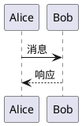

**关键特性：**
- `->` 实线箭头（同步消息）
- `-->` 虚线箭头（异步消息/返回）
- `<-` 和 `<--` 反向箭头
- `participant` 声明参与者
- `actor`、`boundary`、`control`、`entity`、`database`、`collections`、`queue` 改变参与者形状

**参与者控制：**
```plantuml
@startuml
participant "参与者名称" as 别名 #颜色
actor 用户
boundary 边界
control 控制
entity 实体
database 数据库
@enduml
```

**消息组合：**
- `alt/else` - 条件分支
- `opt` - 可选过程
- `loop` - 循环
- `par` - 并行
- `break` - 中断
- `critical` - 关键区域
- `group` - 自定义分组

**生命线控制：**
- `activate` / `deactivate` - 激活/撤销生命线
- `autoactivate on` - 自动激活
- `return` - 返回消息
- `create` - 创建新对象
- `destroy` - 销毁对象
- `++` - 快捷激活
- `--` - 快捷撤销
- `**` - 快捷创建
- `!!` - 快捷销毁

**编号和分隔：**
- `autonumber` - 自动消息编号
- `== 标题 ==` - 分隔符
- `|||` 或 `||数字||` - 增加空间
- `...` 或 `...描述...` - 延迟标记
- `newpage` - 分页

### 2. 用例图 (Use Case Diagram)

描述系统的功能需求和用户交互。

**基本语法：**
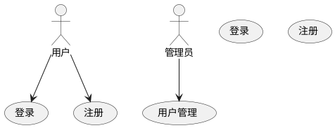

**关键特性：**
- `actor` - 定义角色
- `(用例名称)` - 定义用例
- `-->` - 关联关系
- `.>` 或 `..>` - 包含/扩展关系
- `package` - 分组用例
- `rectangle` - 矩形分组
- 业务用例：在用例后加 `/`

### 3. 类图 (Class Diagram)

展示系统的类结构及其关系。

**基本语法：**
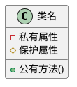

**元素类型：**
- `class` - 普通类
- `abstract class` - 抽象类
- `interface` - 接口
- `enum` - 枚举
- `struct` - 结构体
- `annotation` - 注解
- `entity` - 实体

**可访问性修饰符：**
- `-` - private（私有）
- `#` - protected（受保护）
- `~` - package private（包内可见）
- `+` - public（公有）

**关系类型：**
- `<|--` - 扩展/继承
- `<|..` - 实现
- `*--` - 组合（强聚合）
- `o--` - 聚合（弱聚合）
- `-->` - 依赖
- `..>` - 弱依赖

**其他特性：**
- `<<stereotype>>` - 版型/构造型
- `{static}` - 静态成员
- `{abstract}` - 抽象成员
- `{method}` / `{field}` - 强制指定类型
- 分隔符：`--`、`..`、`==`、`__`

### 4. 活动图 (Activity Diagram)

描述业务流程或算法流程。

**基本语法：**
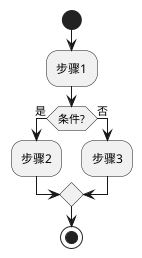

**关键元素：**
- `start` / `stop` - 开始/结束
- `:动作:` - 活动节点
- `if/then/else` - 条件判断
- `repeat` / `repeatwhile` / `repeatwhile (backward)` - 循环
- `while` / `endwhile` - while循环
- `fork` / `fork again` / `end fork` - 并行
- `note` - 注释

### 5. 组件图 (Component Diagram)

展示系统的组件及其依赖关系。

**基本语法：**
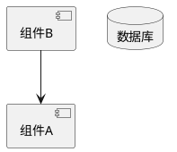

**关键元素：**
- `[组件名]` - 组件
- `()` - 接口
- `database` - 数据库
- `port` - 端口
- `skinparam componentStyle` - 切换 UML1/UML2 样式

### 6. 部署图 (Deployment Diagram)

展示系统的物理部署结构。

**基本语法：**
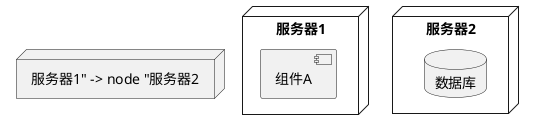

### 7. 状态图 (State Diagram)

描述对象的状态变化。

**基本语法：**
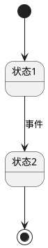

**关键特性：**
- `[*]` - 初始/终止状态
- `-->` - 状态转换
- `state "名称" as 别名` - 定义状态
- 嵌套状态：用大括号 `{}` 包含
- 并发状态：用 `--` 分隔

### 8. 非UML图表

#### 思维导图 (MindMap)
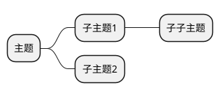

#### 甘特图 (Gantt)
```plantuml
@startgantt
任务1 takes 3 days
任务2 starts after 任务1
@endgantt
```

#### 架构图 (Diagram)
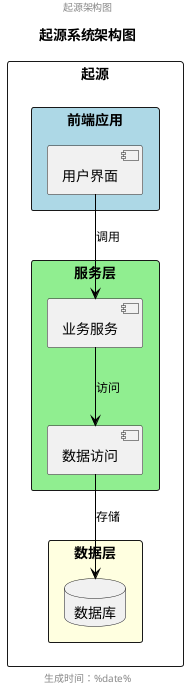

#### 网络图 (nwdiag)
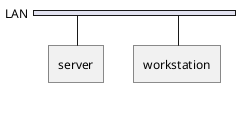

#### JSON/YAML 数据可视化
```plantuml
@startuml
json {
  "key": "value"
}
@enduml
```

## 高级功能

### 1. 样式定制 (skinparam)

```plantuml
@startuml
skinparam backgroundColor #EEEBDC
skinparam handwritten true
skinparam sequenceMessageAlign center
skinparam classAttributeIconSize 0

' 针对特定元素设置样式
skinparam actor {
  backgroundColor aqua
  borderColor DeepSkyBlue
  FontColor DeepSkyBlue
}
@enduml
```

**常用参数：**
- `backgroundColor` - 背景颜色
- `borderColor` - 边框颜色
- `FontColor` / `FontSize` / `FontName` - 字体设置
- `shadowing` - 阴影效果
- `handwritten` - 手写风格
- `monochrome` - 单色模式

### 2. 注释

```plantuml
' 单行注释
/'
多行
注释
'/

note left of 对象 : 左侧注释
note right of 对象 : 右侧注释
note over 对象1, 对象2 : 跨对象注释
note over 对象
多行注释
end note

hnote over 对象 : 六边形注释
rnote over 对象 : 矩形注释
note across : 跨所有参与者注释
```

### 3. 分组和引用

```plantuml
@startuml
== 阶段1 ==
alt 成功
  :操作1;
else 失败
  :操作2;
end

ref over 参与者 : 引用说明

divider 分隔线
@enduml
```

### 4. 箭头样式

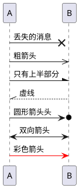

### 5. 图标和精灵图

```plantuml
@startuml
!include <archimate/Archimate>
!include <material/folder>
!include <font-awesome-5/cloud>

rectangle "示例" <<$folder>>
@enduml
```

### 6. 布局控制

```plantuml
@startuml
' 改变方向
left to right direction
top to bottom direction

' 布局引擎
!pragma layout smetana
!pragma layout elk

hide @unlinked  ' 隐藏未连接的元素
remove @unlinked  ' 删除未连接的元素
@enduml
```

## 最佳实践

1. **文件命名**：使用 `.puml` 扩展名
2. **注释**：使用 `'` 添加单行注释，`/' '/` 添加多行注释
3. **别名**：使用 `as` 关键字为复杂名称创建别名
4. **颜色**：使用标准颜色名或十六进制值
5. **换行**：在文本中使用 `\n` 手动换行
6. **编码**：确保文件使用 UTF-8 编码以支持中文
7. **模块化**：使用 `!include` 包含其他文件
8. **一致性**：保持代码风格一致，适当使用空行和缩进

## 输出格式

PlantUML 支持多种输出格式：
- PNG - 图像共享
- SVG - 可缩放矢量图形
- LaTeX - 高质量排版
- ASCII art - 文本表示（仅序列图）

## 参考资源

- [PlantUML 官方网站](https://plantuml.com/zh/)
- [PlantUML 语言参考指南](https://plantuml.com/zh/guide)
- [常见问题](https://plantuml.com/zh/faq)

## 示例项目规范

在本项目中使用 PlantUML 时：
1. 所有图表文件使用 `.puml` 扩展名
2. 图表应包含清晰的标题和描述
3. 使用注释说明复杂逻辑
4. 保持代码格式一致性和可读性
5. 优先使用中文注释和说明
6. 对于大型架构图，合理使用分组和颜色编码

## Git 提交规范

### 提交信息格式

使用中文提交信息，遵循约定式提交（Conventional Commits）格式：

```
<类型>: <简短描述>

<详细描述（可选）>

Co-Authored-By: Claude Opus 4.6 <noreply@anthropic.com>
```

### 类型（Type）

| 类型 | 说明 | 示例 |
|------|------|------|
| `feat` | 新功能（新图表、新组件等） | `feat: 添加前端架构组件图` |
| `fix` | 修复错误（语法错误、显示问题等） | `fix: 修复序列图参与者显示问题` |
| `docs` | 文档更新（README、注释等） | `docs: 更新 PlantUML 技能文档` |
| `style` | 代码格式调整（不影响功能的样式修改） | `style: 统一图表配色方案` |
| `refactor` | 重构（既不是新功能也不是修复） | `refactor: 优化类图结构` |
| `perf` | 性能优化 | `perf: 优化图表渲染速度` |
| `test` | 测试相关 | `test: 添加图表验证脚本` |
| `chore` | 构建过程或辅助工具变动 | `chore: 更新 .gitignore 配置` |

### 提交示例

**新功能：**
```
feat: 添加前端架构组件图

- 添加 React 组件关系图
- 添加状态管理流程图

Co-Authored-By: Claude Opus 4.6 <noreply@anthropic.com>
```

**修复：**
```
fix: 修复序列图参与者显示问题

调整 participant 声明顺序以正确显示

Co-Authored-By: Claude Opus 4.6 <noreply@anthropic.com>
```

**文档：**
```
docs: 更新 PlantUML 技能文档

添加思维导图和甘特图的语法说明

Co-Authored-By: Claude Opus 4.6 <noreply@anthropic.com>
```

### Git 工作流程

1. **添加文件**：`git add <文件>`
2. **提交更改**：使用上述格式的提交信息
3. **推送远程**：`git push`
4. **修改提交**：如需修改最后一次提交，使用 `git commit --amend`
5. **强制推送**：修改历史后需要 `git push --force-with-lease`

### 注意事项

- 每次提交应包含 `Co-Authored-By` 署名
- 提交信息使用中文
- 简短描述不超过 50 字符
- 详细描述（如有）说明为什么做这个改动
- 一个提交只做一件事
