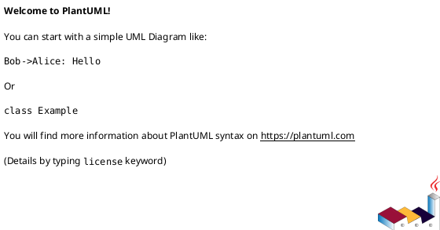

# CLAUDE.md

This file provides guidance to Claude Code (claude.ai/code) when working with code in this repository.

## Project Overview

This is a PlantUML diagram repository for storing and managing UML diagrams and technical documentation. The project uses PlantUML's text-to-diagram syntax to create various types of UML and non-UML diagrams.

## Project Structure

```
uml/
├── .claude/
│   └── skills/
│       └── plantuml.md          # PlantUML expert skill with comprehensive syntax reference
├── aimall/                       # Main project diagrams
│   └── cicd/
│       └── front_end/           # Frontend architecture diagrams
└── CLAUDE.md                     # This file
```

## PlantUML Development

### File Conventions
- Use `.puml` extension for all PlantUML diagram files
- Use UTF-8 encoding to support Chinese characters
- Include descriptive comments using `'` for single-line or `/' '/` for multi-line

### Basic Structure
All PlantUML diagrams must be wrapped in:


### Available Skills
This repository includes a custom PlantUML expert skill at `.claude/skills/plantuml.md` that provides:
- Complete syntax reference for all diagram types
- Code examples for common patterns
- Styling and customization options
- Best practices for diagram organization

Refer to this skill when creating or modifying PlantUML diagrams.

## Diagram Types

Commonly used diagram types in this project:
- **Sequence Diagrams** - For illustrating API interactions and message flows
- **Class Diagrams** - For showing system architecture and data models
- **Component Diagrams** - For visualizing system components and dependencies
- **Deployment Diagrams** - For infrastructure and deployment architecture
- **Activity Diagrams** - For business processes and workflows
- **Architecture Diagrams** - Using Archimate or custom diagrams for system overviews

## Working with PlantUML

### Rendering Diagrams
PlantUML diagrams can be rendered using:
- PlantUML CLI: `java -jar plantuml.jar diagram.puml`
- Online editor: https://plantuml.com/zh/online
- IDE plugins (VS Code, IntelliJ IDEA, etc.)

### Including External Resources
Use `!include` to reference external libraries or common definitions:
```plantuml
!include <archimate/Archimate>
!include <material/folder>
!include <font-awesome-5/cloud>
```

### Styling Guidelines
- Use `skinparam` for consistent styling across diagrams
- Apply meaningful colors to differentiate components
- Use Chinese labels and descriptions for diagrams in this project
- Keep diagrams focused and consider splitting complex ones into multiple files

## Git Workflow

### Commit Message Convention

使用中文提交信息，遵循约定式提交（Conventional Commits）格式：

```
<类型>: <简短描述>

<详细描述（可选）>

Co-Authored-By: Claude Opus 4.6 <noreply@anthropic.com>
```

**类型（Type）：**
- `feat` - 新功能（新图表、新组件等）
- `fix` - 修复错误（语法错误、显示问题等）
- `docs` - 文档更新（README、注释等）
- `style` - 代码格式调整（不影响功能的样式修改）
- `refactor` - 重构（既不是新功能也不是修复）
- `perf` - 性能优化
- `test` - 测试相关
- `chore` - 构建过程或辅助工具变动

**示例：**
```
feat: 添加前端架构组件图

- 添加 React 组件关系图
- 添加状态管理流程图

Co-Authored-By: Claude Opus 4.6 <noreply@anthropic.com>
```

```
fix: 修复序列图参与者显示问题

Co-Authored-By: Claude Opus 4.6 <noreply@anthropic.com>
```

```
docs: 更新 PlantUML 技能文档

添加思维导图和甘特图的语法说明

Co-Authored-By: Claude Opus 4.6 <noreply@anthropic.com>
```

### General Guidelines
- `.idea/` directory is ignored by Git
- Include preview images (PNG/SVG) when committing diagram changes for easy review
- 每次提交应包含 Co-Authored-By 署名
